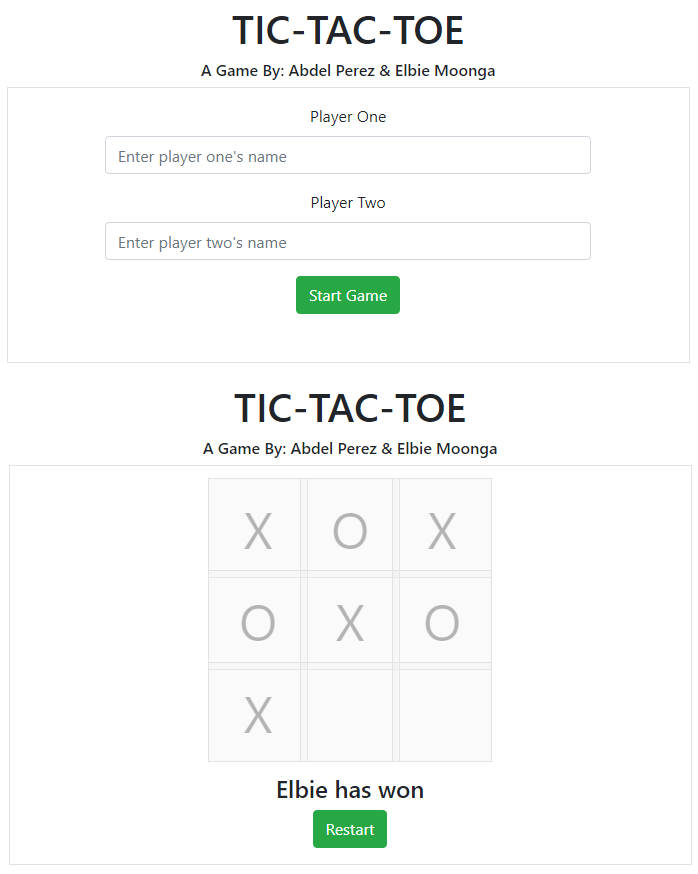

# Tic Tac Toe

> This project consists of building a tic-tac-toe game on the browser with javascript for two players.



## Built With

- Javascript
- HTML5
- CSS
- Bootstrap 4.5
- ESLint
- Stylelint

## Gameplay

- To start the game enter the name of the two players on the home page and press "Start Game".
- A gameboard will be displayed.
- Players will choose slots available.
- The first player is assigned to the **X**, and the second player is assigned to the **O**
- Slots are disabled once selected.
- The player wins when they have all the X's or O's filled in the same row, column, or the diagonals.
- If no player gets a filled row, column or diagonal, and all of the slots are selected, it is a draw.

## Live Demo

[Live Demo Link](https://vibrant-kilby-38d43d.netlify.app/)


## Requirements

- Compatible Web browser (Chrome, Mozilla, IE, Safari)

## Installation

### Steps

From the command line/terminal clone the repository:

    $ git clone https://github.com/Elbie-em/JavaScript-Tic-Tac-Toe-Game.git

Install npm packages:

```
npm i
```

### Start Playing

Go to the root folder of the project and open the index.html file in your browser:

### Testing

To run the tests:

```
npx jest --watch
```

## Authors

👤 **Elbie Moonga**
- GitHub: [@Elbie-Em](https://github.com/Elbie-em)
- Twitter: [ElbieEm](https://twitter.com/ElbieEm)
- LinkedIn: [elbie-moonga](https://www.linkedin.com/in/elbiemoonga/)

👤 **Abdel Pérez**

- Github: [@abdelp](https://github.com/abdelp/)
- Twitter: [@AbdelPerez11](https://twitter.com/abdelperez11)
- Linkedin: [Abdel Pérez](https://www.linkedin.com/in/abdel-perez/)


## 🤝 Contributing

Contributions, issues and feature requests are welcome!

Feel free to check the [issues page](https://github.com/Elbie-em/JavaScript-Tic-Tac-Toe-Game/issues).

## Show your support

Give a ⭐️ if you like this project!

## 📝 License

This project is [MIT](lic.url) licensed.